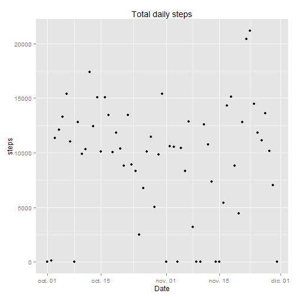
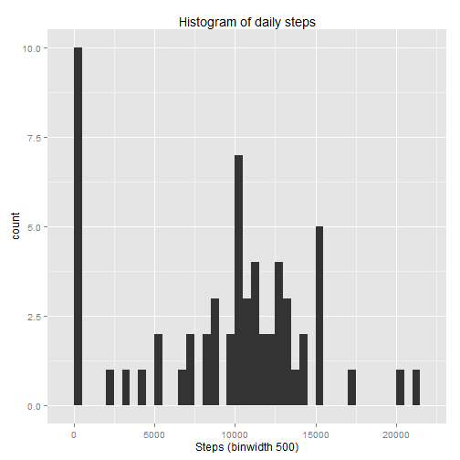
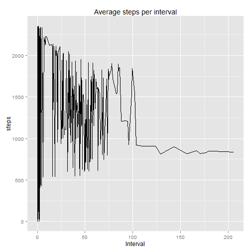
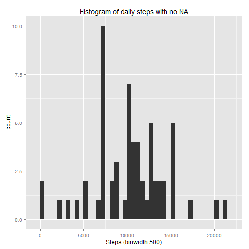
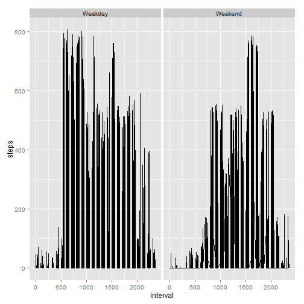

#Loading and preprocessing the data

1. Load the data:

```r
dades <- read.csv("activity.csv")
library(plyr)
library(ggplot2)
library(data.table)
library(car)
```

2. Process/transform the data (if necessary) into a format suitable for your analysis:


```r
dades$date<-as.Date(dades$date,"%Y-%m-%d")
```

#What is mean total number of steps taken per day?

```r
#1.Calculate the total number of steps taken per day
dadessum<-aggregate(x=dades$steps,by=list(dades$date),FUN=sum,na.rm=TRUE)
names(dadessum)<-c("date","steps")

lineplot<-ggplot(dadessum,aes(date,steps))+
        geom_point()+
        ggtitle("Total daily steps") +
        xlab("Date")
lineplot
```

 

```r
#2. Make histogram of total number steps per day
histog <- ggplot(dadessum,aes(x = steps)) +
            ggtitle("Histogram of daily steps") +
            xlab("Steps (binwidth 500)") +
            geom_histogram(binwidth = 500)
histog
```

 

```r
#3. calculate mean an median of total steps per day
#Mean:
mean(dadessum$steps)
```

```
## [1] 9354.23
```

```r
#Median:
median(dadessum$steps)
```

```
## [1] 10395
```

#What is the average daily activity pattern?


```r
#1. Time series plot of the 5-minute interval mean steps per interval
dadesmean<-aggregate(x=dades$steps,by=list(dades$interval),FUN=mean,na.rm=TRUE)
names(dadesmean)<-c("steps","interval")
timeseries <- ggplot(dadesmean,aes(interval,steps))+
        geom_line()+
        ggtitle("Average steps per interval") +
        xlab("Interval")
timeseries
```

 

```r
maxim<-dadesmean[dadesmean$steps==max(dadesmean$steps),]
#The maxim number steps in one interval is
maxim$steps
```

```
## [1] 2355
```

```r
#2. And occurs at interval
maxim$interval
```

```
## [1] 1.075472
```

#Imputing missing values


```r
#1. Total number of missing values are
sum(is.na(dades$steps))
```

```
## [1] 2304
```

```r
#2. Replace missing values with mean of the interval

replace.na <- merge(x = dades, y = dadesmean, by = "interval", all.x = TRUE)
replace.na[is.na(replace.na$steps.x),c("steps.x")] <- replace.na[is.na(replace.na$steps.x),c("steps.y")]

#3. Create new dataset:
replace.na<-replace.na[,1:3]
names(replace.na)<-c("interval","steps","date")

#4. make histogram
dadessum2<-aggregate(x=replace.na$steps,by=list(replace.na$date),FUN=sum,na.rm=TRUE)
names(dadessum2)<-c("date","steps")
histog <- ggplot(dadessum2,aes(x = steps)) +
            ggtitle("Histogram of daily steps with no NA") +
            xlab("Steps (binwidth 500)") +
            geom_histogram(binwidth = 500)
histog
```

 

```r
#calculate mean an median of total steps per day with no NA
mean(dadessum2$steps)
```

```
## [1] 10303.05
```

```r
median(dadessum2$steps)
```

```
## [1] 10439
```

```r
#The mean in general increasess in %:
mean(dadessum2$step)/mean(dadessum$step)*100
```

```
## [1] 110.1432
```

```r
# Its some increase

#The median in general increseasess in %:
median(dadessum2$step)/median(dadessum$step)*100
```

```
## [1] 100.4233
```

```r
#It's an insginificant increases
```

#Are there differences in activity patterns between weekdays and weekends?

```r
#1. New factor variable
dades$dateP <- as.POSIXlt(dades$date,format="%Y-%m-%d")
dades$day <- "Weekday"
dades$day [weekdays(dades$dateP) %in% c("sábado","domingo")] <- "Weekend"

#2. Weekday/Weekend Comparison
dades.day <- aggregate(dades[,1],
                                   by=dades[,c(3,5)],
                                   FUN=mean,
                                   na.rm=TRUE)
head(dades)
```

```
##   steps       date interval      dateP     day
## 1    NA 2012-10-01        0 2012-10-01 Weekday
## 2    NA 2012-10-01        5 2012-10-01 Weekday
## 3    NA 2012-10-01       10 2012-10-01 Weekday
## 4    NA 2012-10-01       15 2012-10-01 Weekday
## 5    NA 2012-10-01       20 2012-10-01 Weekday
## 6    NA 2012-10-01       25 2012-10-01 Weekday
```

```r
library(ggplot2)
plot <- ggplot(dades,
              aes(x=interval,y=steps))
plot + geom_line() + facet_grid(.~day)
```

```
## Warning: Removed 2 rows containing missing values (geom_path).
```

 
Yes there are diferences at weekend he wake up late, and make more steps at evenning.
